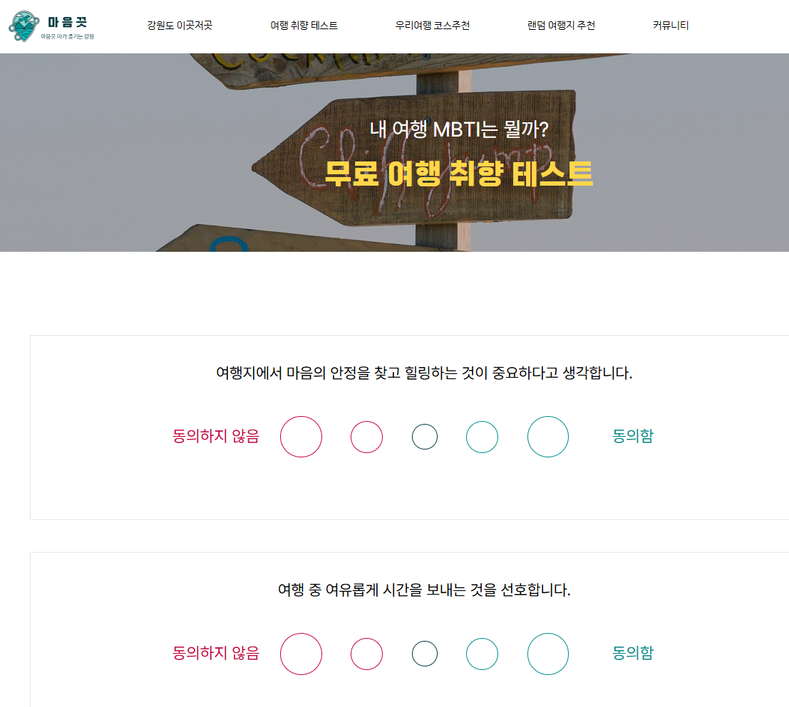
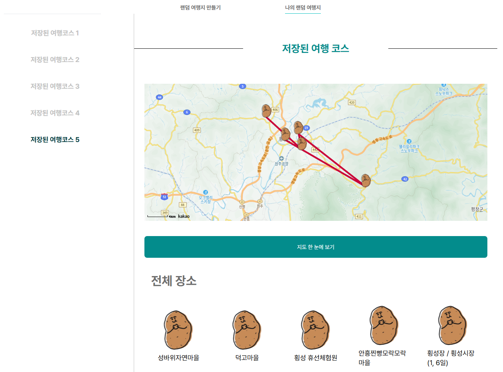
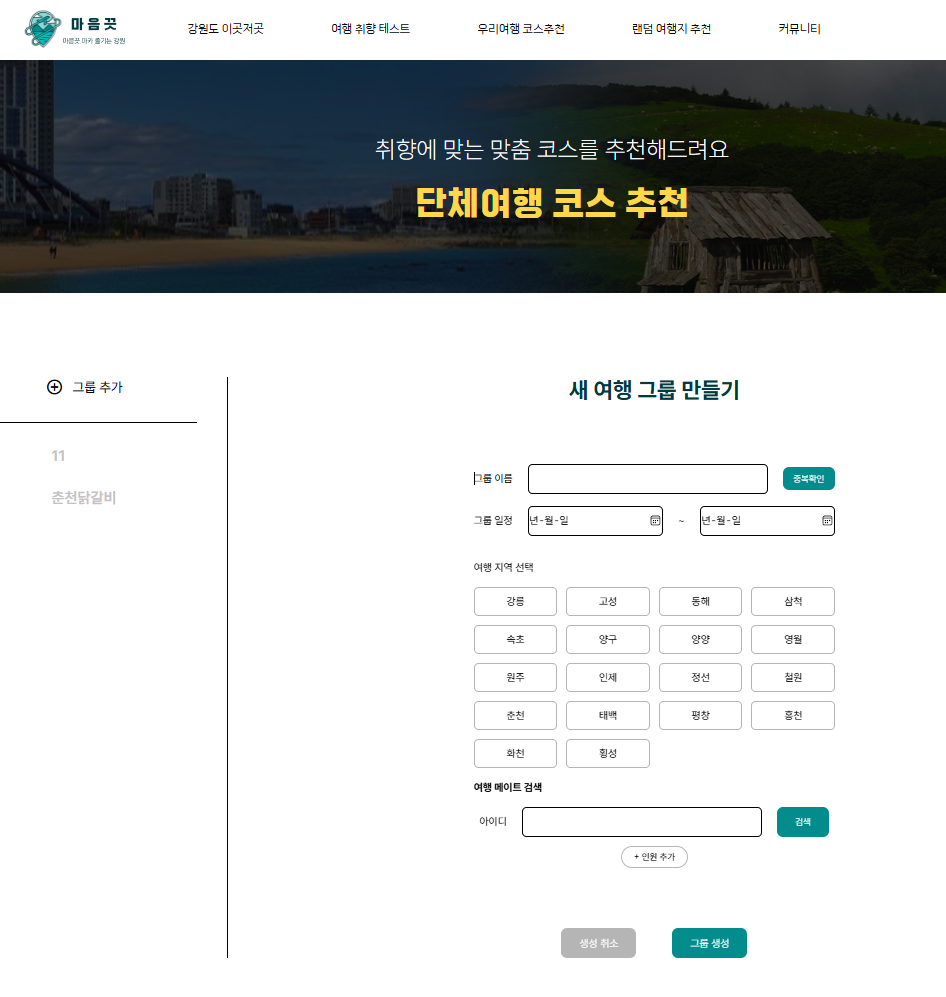
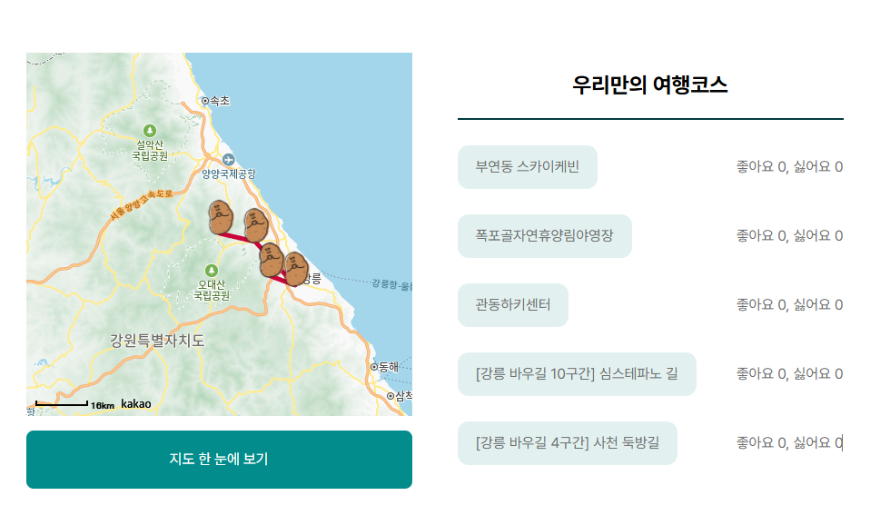
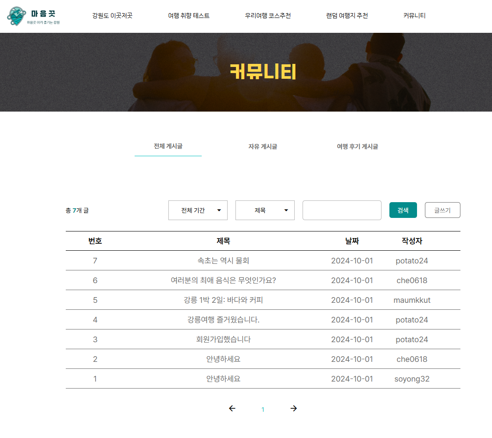

# Backend# 마음끗

## 📅 프로젝트 기간

- 2024.05.21 ~ 2024.10.01

## 📖 프로젝트 개요

그룹 기반 강원도 여행지 추천 서비스

### 👩🏻‍🔧 **기술 스택**

### BE

---

#### 🚀 프레임워크 및 라이브러리

 
 

#### 📂 DB 및 스토리지

 

#### 🎁 API

 

### FE

---

#### 🚀 프레임워크 및 라이브러리

  
  
   
  
  #### 📊 상태 관리
   
  
  
  #### 📡 데이터 요청
  
  
  #### 💄 스타일링
   
  

## 📖 **페이지별 기능**

여행 취향 테스트
  

랜덤 여행지 추천
  

단체 코스 추천
  

커뮤니티
  

## 구현사항

- 프로젝트 기획 및 설계
  - 데이터 리서치 및 분석을 통한 프로젝트 방향성 수립
  - Django 기반 서버 환경 구축
- 핵심 기능 개발
  - 게시판 CRUD 기능 구현
  - Django ORM을 사용한 검색 시스템
  - 데이터팀 개발 메서드 연동
  - Swagger를 통한 API 문서화

## 성과 및 배운점

### 협업

8명의 팀원이 5개 파트로 나뉘어 진행한 프로젝트에서 다양한 분야와의 협업 프로세스를 체득할 수 있었습니다. 특히 Django Swagger를 활용하여 프론트엔드 팀과 원활한 커뮤니케이션과 협업 체계를 구축했으며, 이를 통해 API 문서화의 중요성을 깊이 인식하게 되었습니다.

### Django 프로젝트

Django ORM을 활용하는 과정에서는 쿼리에 따라 데이터베이스 접근 속도에 차이가 있을 수 있다는 점을 배웠습니다. 또한, 데이터베이스 설계에 따라 기능의 실행 속도가 달라질 수 있다는 사실도 깨달았습니다. 이러한 경험은 향후 프로젝트에서 더욱 효율적인 데이터베이스 설계와 쿼리 최적화에 중점을 두어야 한다는 중요한 교훈을 주었습니다.